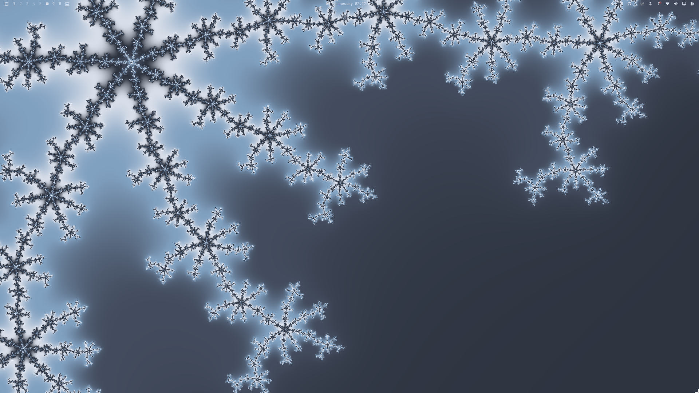

# Fractal Wallpaper + Screensaver Plugin for Omarchy

An infinite zoom into a fractal, colored by your theme. Features Misiurewicz points from the Mandelbrot set and the higher-degree
Multibrots, with a Julia set at each one. Not very lightweight.

## Install

```sh
omarchy plugin add https://github.com/knappkevin/fractal.git --enable
```

`Super + Ctrl + Space` to pick it from the wallpaper picker. Double click to open its settings.

<table>
<tr>
<td></td>
<td></td>
</tr>
<tr>
<td></td>
<td></td>
</tr>
</table>

## Runtime IPC

```sh
omarchy-shell fractal help               # lists some more unneeded commands
omarchy-shell fractal menu               # alternative to double clicking for settings
```

## Remove

```sh
omarchy plugin remove knappkevin.fractal
```
