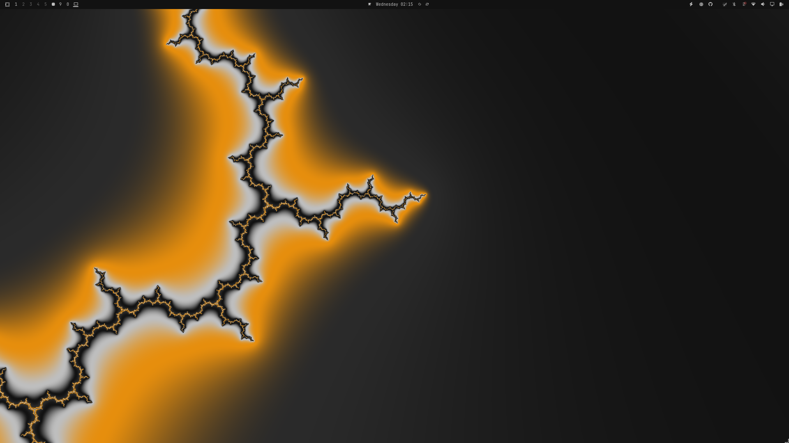
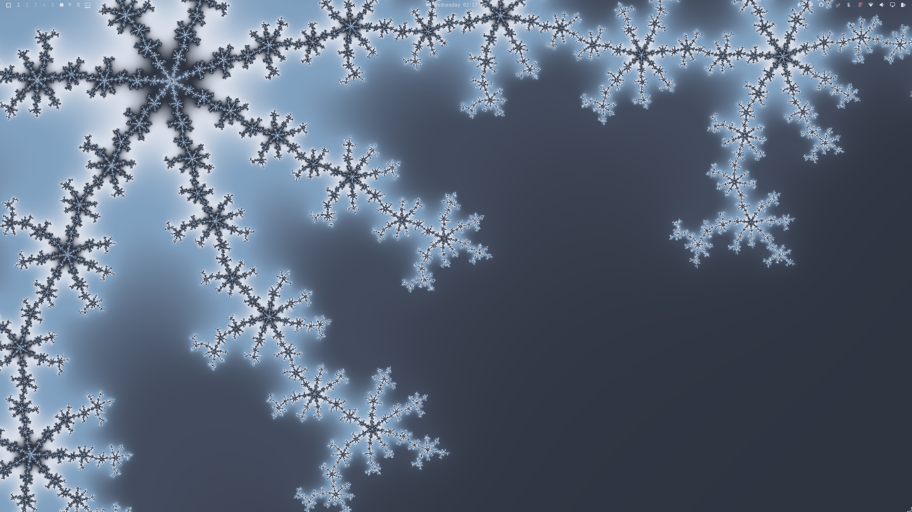
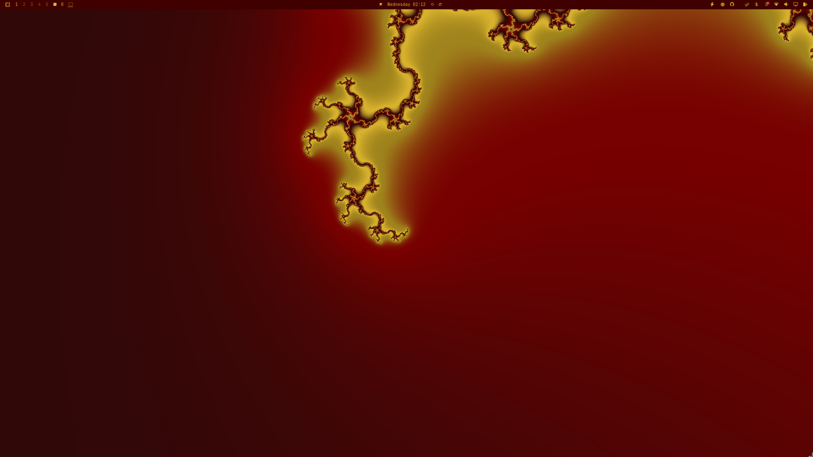

# Fractal Wallpaper Plugin for Omarchy

An infinite zoom into a fractal, drawn in the colors of your active theme. Features 12 different Misiurewicz points in the Mandelbrot set. Pick it from the background switcher like any other wallpaper. Not very lightweight.

Each picture below is one of the points, named after the one it shows, in whatever theme
was active at the time — the colours are the theme's, so the same point looks quite
different on a different theme.

<table>
<tr>
<td></td>
<td></td>
</tr>
<tr>
<td></td>
<td></td>
</tr>
</table>

## Install

```sh
omarchy plugin add https://github.com/knappkevin/fractal.git --enable
```

`Super + Ctrl + Space` to pick it from the wallpaper picker.

## Requirements

- Omarchy's Quattro shell, and `python3`. The picker image is rendered by
  `tools/marker.py`, which uses the standard library only.
- `gcc` to build `perturb`, the CPU reference renderer, on first use. It is
  deliberately not shipped prebuilt, because a binary cannot be checked against
  the source a reviewer read. It is compiled into
  `~/.local/state/omarchy/fractal/`, never into the plugin tree.

Without `gcc` the wallpaper itself still runs. Only the picker image falls back
to the still in `assets/`, which is drawn in whatever theme it was made in.

## Runtime IPC

```sh
omarchy-shell fractal help                     # every command, with what it does
omarchy-shell fractal point list               # the zoom points available
omarchy-shell fractal point next               # move along to the next one
omarchy-shell fractal point random             # jump to one at random now
omarchy-shell fractal point lightning          # zoom into a named point
omarchy-shell fractal pause toggle             # pause the animation
omarchy-shell fractal fps 20                   # how many frames a second to draw
omarchy-shell fractal speed 0.03               # octaves of zoom per second
omarchy-shell fractal scale 0.5                # draw at half the screen, then stretch up
omarchy-shell fractal bands 1.0                # how busy the colour banding is
omarchy-shell fractal refresh                  # re-read the theme, remake the picker image
```

Every setting also accepts `get` to read its value without changing it:
`omarchy-shell fractal fps get`.

## Configuration

The commands above persist what they set, on the plugin's entry in
`~/.config/omarchy/shell.json`, under `plugins[]`. Everything the plugin reads
is reachable from an IPC command except two settings, which are edited there
directly:

```json
{ "id": "knappkevin.fractal", "markers": true, "poll": false }
```

| Key | Default | Set with | What it does |
|---|---|---|---|
| `fps` | `20` | `fractal fps` | Frames drawn per second |
| `speed` | `0.03` | `fractal speed` | Octaves of zoom per second |
| `scale` | `1` | `fractal scale` | Render at this fraction of the screen, then stretch up. The cheapest way to cut GPU load |
| `bands` | `1.0` | `fractal bands` | Multiplier on the fractal's own colour band frequency |
| `paused` | `false` | `fractal pause` | Hold the animation still |
| `pauseWhenCovered` | `false` | `fractal pauseWhenCovered` | Pause while windows cover the whole screen |
| `randomPoint` | `true` | `fractal randompoint` | Start on a different point each launch |
| `point` | | `fractal point` | The point in use, if one was named by hand |
| `markers` | `true` | shell.json only | Write the background-picker image at all |
| `poll` | `false` | shell.json only | Re-read the wallpaper every couple of seconds, for a host whose background service cannot be reached |

The shell reloads `shell.json` on save, so an edit applies at once.

## Update

```sh
omarchy plugin update knappkevin.fractal
```

## Remove

```sh
omarchy plugin remove knappkevin.fractal
```

This does not remove the picker image the plugin wrote into your theme's
backgrounds directory. Delete
`~/.local/state/omarchy/current/theme/backgrounds/fractal-zoom.png` if you want
it gone before switching wallpapers.

## Development

The fractal itself is a fragment shader. Each zoom point is a Misiurewicz point
of the Mandelbrot set, chosen because the orbit returns near its start, which is
what lets the loop wrap without a seam.

```
mandelbrot/points/*.json    one file per point: its coordinates, period, and how many octaves one loop buys
mandelbrot/shaders/*.frag   GLSL generated from the point, plus the .qsb compiled from it
tools/gen.py                point json -> .frag
tools/perturb.c             CPU reference renderer, at full precision
tools/catalogue.py          measures a candidate point and writes its .json
tools/mkpoint.py            a refined point -> .json
tools/mis.c                 locates Misiurewicz points in a box of the plane
tools/marker.py             renders the picker image from a point and the live theme
tools/candidates.txt        candidate points for the catalogue
```

Regenerate every shader and the catalogue index:

```sh
tools/build.sh    # needs gcc and qt6-shadertools
```

The native tools are rebuilt from source on every run and are never committed.
`perturb` is the CPU renderer the catalogue gates each point against and the
marker image is drawn from, so the shader and the reference cannot drift apart.

## License

MIT — see [LICENSE](LICENSE).
